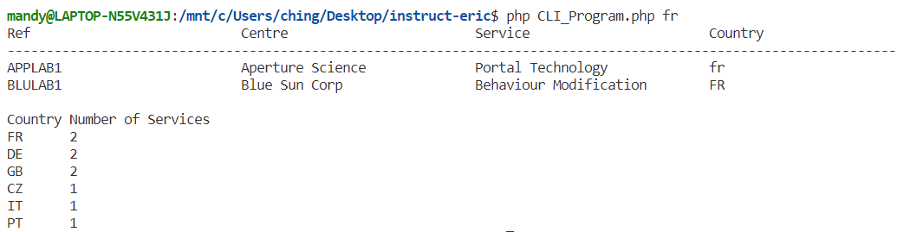

# PHP-CLI-Code-Challenge

## Introduction
This PHP-based CLI program is designed to enable users to query service data from the services.csv file based on country codes. When executed, it reads the services.csv file located in the same directory, filtering and displaying service information for the specified country code, along with a summary of the services.

## Setup
Install PHP 7 or above.
Clone the git repository to your local machine.

## Running the Program
Run the PHP file with a country code as an argument to display filtered results and a summary output. Use the following command format in your terminal:

#### For Windows Command Line:
location_of_PHP.exe location_of_program.php <country_code>

Example:
```
C:\xampp\php\php.exe C:\Users\ching\Desktop\code_challenge\CLI_Program.php FR
```

#### For Linux Command Line:
php location_of_program.php <country_code>

Example:
```
php CLI_Program.php GB
```

## Result Example

